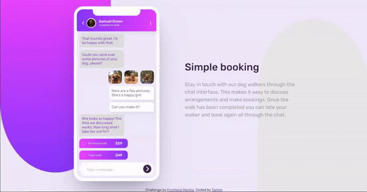

# Frontend Mentor - Chat app CSS illustration solution

This is a solution to the [Chat app CSS illustration challenge on Frontend Mentor](https://www.frontendmentor.io/challenges/chat-app-css-illustration-O5auMkFqY). Frontend Mentor challenges help you improve your coding skills by building realistic projects. 

## Table of contents

- [Overview](#overview)
  - [The challenge](#the-challenge)
  - [Preview](#preview)
  - [Links](#links)
- [My process](#my-process)
  - [Built with](#built-with)
  - [What I learned](#what-i-learned)
  - [Continued development](#continued-development)
- [Author](#author)
- [Acknowledgments](#acknowledgments)

## Overview

### The challenge

Users should be able to:

- View the optimal layout for the component depending on their device's screen size
- **Bonus**: See the chat interface animate on the initial load

### Preview

### Links

- Solution URL: [Frontend Mentor link](https://www.frontendmentor.io/solutions/chat-app-css-illustration-U1_VEsSTzV)
- Live Site URL: [Github pages link](https://tamimtxd.github.io/Chat-app-CSS-illustration-solution/)

## My process

### Built with

- HTML5
- Vanilla CSS
- Flexbox
- Flexible units
- Media quary
- CSS animation

### What I learned

Nothing new, just keep practicing to be a expert and this challenge made me more confident.

### Continued development

I think now I'm pretty confident to start my JavaScript journey.

## Author

- Frontend Mentor - [@tamimtxd](https://www.frontendmentor.io/profile/tamimtxd)
- Gmail - tamimmtd@gmail.com
- Facebook - [@tamimtxd](https://www.facebook.com/tamimtxd)

## Acknowledgments

[Frontend Mentor](https://www.frontendmentor.io/) is a place where I can grow my coding skills, now I can surely say that after completing this challenge.
